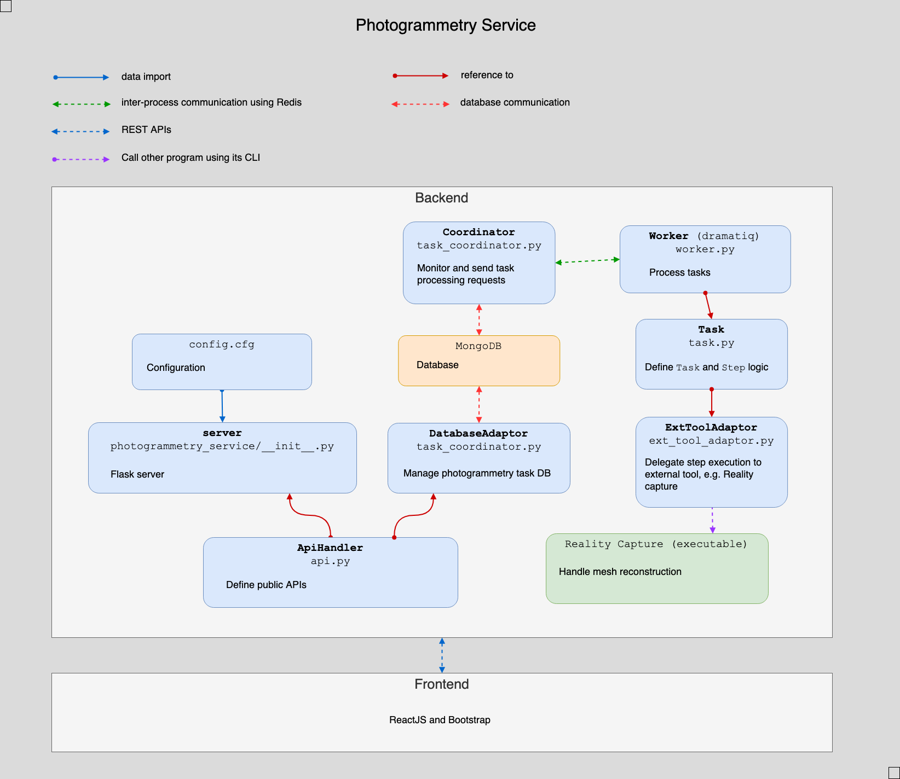

# Photogrammetry Service Backend

Backend for *Photogrammetry Service*

This is a multi-component system, including

- `Redis` as message queue broker
- `MongoDB` for database
- `worker` ( based on `dramatiq` ) receives request and process `Task`, which contains many `Step` +
Depend on `Step` of `Task`, there is additional external program that take over duty from `worker` (e.g. Reality Capture)
- `Coordinator` monitors the state of tasks in database and send task processing requests to `worker`, as well as updating database
- `Flask` server takes care of user REST APIs

Each component is basically a standalone process.

## How to start the service

### 1. Install dependencies

*Windows*

Install Python 3.8 at `C:\Python38`

Then run `setup.cmd`

*Mac/Linux*

Install Python >=3.8 and add `python3` to `PATH`

Then run `setup.sh`

### 2. Install external applications

These apps need to be installed and configured in `config.py`

- Adobe DNG Converter
- Reality Capture

### 3. Run services ( Windows only )

- run_coordinator.cmd
- run_redis.cmd
- run_server.cmd
- run_worker.cmd

NOTE: Please check `config.py` before running to ensure all parameters are set properly. +
Although this backend can run on Linux/Mac, *Reality Capture* is only available on Windows.
